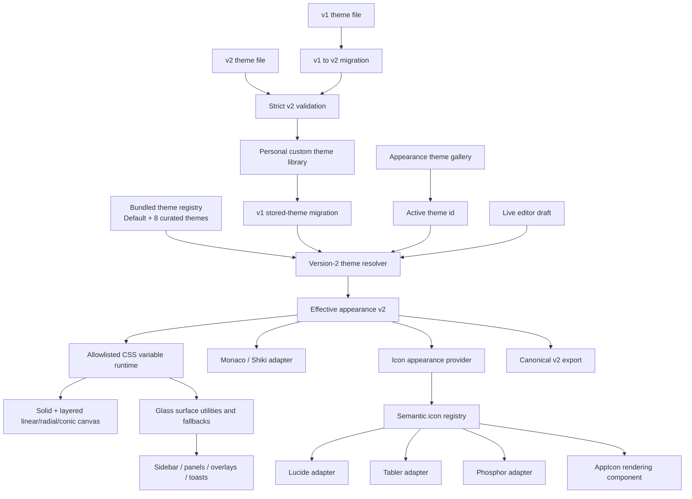

# Summary

Expand the existing shareable Appearance system into a modern visual-design system with:

- **Nine bundled choices total**: preserve **Vixl Default** exactly and add eight curated, immutable themes with complete light/dark variants, coordinated editor palettes, backgrounds, surface effects, and icon styles.
- **Rich custom backgrounds**: solid colors plus bounded multi-layer linear, radial, and conic gradients. Multiple radial layers enable mesh/aurora-style backgrounds without accepting arbitrary CSS, URLs, or images.
- **Glass surfaces**: opt-in translucent sidebars, panels/cards, and overlays with configurable opacity, blur, saturation, border strength, shadow, and safe accessibility/performance fallbacks.
- **Customizable icons**: theme-level icon pack selection among **Lucide, Tabler, and Phosphor**, plus normalized size, weight/stroke, and tint controls. Replace direct Lucide rendering with a semantic icon registry while preserving meaning, labels, state colors, and specialized file/provider artwork.
- **A visual theme gallery and editor** that previews these features before saving, keeps built-ins immutable, and allows any bundled theme to be duplicated into a custom theme.

The work extends the existing personal-only theme library and file sharing model. It does not add arbitrary CSS, remote assets, remote icon packs, per-action glyph uploads, or a marketplace.

# Context

- The completed appearance foundation uses `VixlThemeDefinition` in `src/types/appearance/theme.ts`, strict domain/file schemas, a personal `appearance.themeLibrary`, and `appearance.activeThemeId`.
- `src/constants/appearance/built-in-theme.ts` currently defines only `vixl-default`. Runtime resolution and `AppearanceSection.vue` special-case that one built-in ID.
- Canvas backgrounds currently support a solid color or one 2–5 stop linear gradient. `src/utils/appearance/appearance-css.ts` writes allowlisted variables to the root, and `AppearanceBackgroundEditor.vue` edits the single gradient.
- Cards, dialogs, popovers, sheets, sidebars, and toasts primarily use opaque semantic colors. A few features contain ad-hoc blur or hard-coded Zinc backgrounds; glass behavior is not centralized and there is no reduced-transparency fallback.
- Icons are overwhelmingly direct named imports from `@lucide/vue` across roughly 150 source files, including shadcn primitives and dynamic component maps. There is no app-level icon abstraction. The user selected **global styling plus a small choice of bundled icon packs**, so CSS-only Lucide styling is insufficient.
- File and stored theme format version 1 is strict. New canvas/effect/icon fields require a version-2 canonical model plus explicit v1 migration. Existing users and imported v1 files must continue to work.
- Additional bundled themes must not be stored in the user library or consume its 50-theme limit. Their IDs must be reserved against custom/imported themes.
- The current runtime clears CSS variables whenever `builtIn` is true. That distinction must be split: only the original CSS-default theme can clear variables; other read-only bundled themes still need their values applied.

## Product decisions

- Bundle these initial themes, with final names adjusted only for trademark/license review:
  1. **Vixl Default** — unchanged neutral baseline.
  2. **Midnight Aurora** — indigo/cyan aurora mesh with crystal glass.
  3. **Nordic Frost** — cool slate/ice palette with restrained frosted panels.
  4. **Solar Flare** — warm amber/coral gradients and high-energy accents.
  5. **Rose Quartz** — soft rose/lilac editorial palette.
  6. **Ocean Depths** — deep teal/blue surfaces and luminous code colors.
  7. **Cyber Lime** — dark graphite with lime/violet technical accents.
  8. **Paper & Ink** — warm paper light mode and ink-like dark mode, minimal effects.
  9. **High Contrast** — accessibility-oriented strong boundaries and no transparency.
- Built-ins are selectable, previewable, exportable, and duplicable, but never edited or deleted in place.
- Icon packs are bundled and allowlisted: Lucide remains the compatibility default; Tabler and Phosphor are local dependencies. Theme files store a pack ID, not package code or icon SVG data.
- Pack selection changes app chrome/action icons. Specialized file-type icons, provider/server logos, product marks, and content-supplied artwork remain outside the pack system.

# Architecture

# Approach

## 1. Introduce a version-2 appearance domain and compatibility migration

- Extend `src/types/appearance/theme.ts` with explicit, data-only structures:
  - a canvas fallback color and up to four ordered background layers;
  - `linear`, `radial`, and `conic` layer variants with bounded geometry and 2–6 sorted hex/hex-alpha stops;
  - a per-variant glass configuration with `enabled`, target scopes (`sidebar`, `panels`, `overlays`), surface opacity, blur, saturation, border opacity, shadow preset, and optional corner-radius preset;
  - a per-variant icon appearance with pack (`lucide | tabler | phosphor`), normalized weight, size scale, and tint (`inherit` or safe hex).
- Bump the canonical theme/domain and shareable file version to 2. Keep a dedicated v1 schema rather than weakening strict validation, then add pure migration functions for both persisted library entries and imported files. Linear v1 gradients become one v2 linear layer; solid backgrounds retain the same fallback; glass defaults off; icons default to Lucide/inherit/current sizing.
- Keep v2 strict and bounded: no raw CSS functions, SVG, icon names from files, URLs, image data, arbitrary shadows, or unbounded blur/saturation/compositing.
- Ensure `sanitizeThemeLibrary` migrates valid v1 entries before v2 validation and only drops entries invalid in both supported versions. Export only canonical v2.
- Add a registry-wide reserved-ID set rather than checking only `vixl-default`. Collision handling must rewrite any imported/custom ID that conflicts with any bundled theme.
- Split runtime metadata into `readOnlyBuiltIn` and `usesCssDefaults` (or equivalent). Only Vixl Default uses CSS cascade defaults; curated built-ins are immutable but receive their own runtime variables.

## 2. Build and validate the curated bundled-theme registry

- Refactor `src/constants/appearance/built-in-theme.ts` into a small registry module (and per-theme files if needed) exposing ordered definitions, lookup helpers, `BUILTIN_THEME_IDS`, and the unchanged default export for compatibility.
- Define all eight new themes with complete light/dark semantic colors, canvas layers, typography, Monaco/Shiki palettes, glass settings, and icon appearance. Use original palettes rather than copying branded third-party themes; document inspiration generically and retain project licensing.
- Add registry invariants: unique stable IDs/names, exact v2 shapes, no library-cap consumption, readable editor widgets, and contrast checks. High Contrast must meet enhanced contrast goals where practical; other presets must meet normal text/control contrast or carry a reviewed, documented exception.
- Update active-theme resolution to search bundled registry and personal library deterministically, while `null`, missing, or malformed IDs still fall back to Vixl Default.
- Treat built-ins as immutable in edit/delete flows. “Customize” duplicates a built-in with a collision-safe custom ID; export serializes a valid v2 file.

## 3. Render layered modern canvas backgrounds

- Replace the single-gradient builder in `src/utils/appearance/appearance-css.ts` with pure layer renderers for linear, radial, and conic layers. Compose layers in a stable order into `--vixl-canvas-image`, always retaining the explicit solid fallback in `--vixl-canvas-background`.
- Bound layer count, stops, positions, angles, radial centers, and radial size in schemas and UI helpers. Normalize/sort before rendering and canonical export.
- Update `canvasToCss`, preview signatures, clone/reset helpers, and import/export conversion so the settings preview and app runtime use the same serializer.
- Extend `AppearanceBackgroundEditor.vue` into a layer editor: background fallback, add/remove/reorder/duplicate layer, gradient type, stops, angle, radial center/size, conic origin, alpha-capable text fields, and presets such as Aurora Mesh, Sunset, Spotlight, and Minimal Glow.
- Preserve keyboard operation, textual values alongside color controls, clear labels, and a one-click “reduce effects” action for users who prefer a simpler canvas.

## 4. Add glass surface tokens and apply them consistently

- Add allowlisted runtime variables/data attributes for glass opacity, blur, saturation, border opacity, shadow, and radius. Clear all of them when returning to Vixl Default and include them in effective-appearance signatures/events.
- Implement centralized CSS utilities in `tailwind.css` for the three supported scopes. Use semantic base colors plus `color-mix()`/alpha composition rather than hard-coded palette colors.
- Apply glass hooks to shared top-level primitives and shells—not every nested element—to avoid stacked blur and excessive GPU work:
  - sidebar/sheet navigation surfaces;
  - cards and primary workbench/chat panels selected as panel surfaces;
  - dialog, popover, dropdown, command, tooltip, and toast/sonner overlay surfaces.
- Replace conflicting hard-coded Zinc/opaque/`backdrop-blur-none` classes in provider flows, terminal controls, Sonner, and other identified exceptions with semantic tokens or explicit opt-out hooks.
- Add CSS fallbacks:
  - no `backdrop-filter` support: use a more opaque semantic surface and border;
  - `prefers-reduced-transparency: reduce`: disable blur and force opaque surfaces;
  - `prefers-contrast: more`: disable transparency and strengthen borders;
  - cap blur/saturation and avoid animating blur.
- Add an `AppearanceGlassEditor.vue` with Off/Subtle/Frosted/Crystal presets plus bounded advanced controls and per-scope toggles. Warn when selected translucency can undermine text contrast without silently changing user values.

## 5. Introduce semantic icon packs and migrate app icons

- Add local Tabler and Phosphor Vue icon dependencies alongside Lucide. Confirm licenses and pin versions using repository conventions.
- Create a semantic icon contract (for example `src/icons/icon-names.ts`) covering every app-used action/state/navigation glyph and adapters for Lucide, Tabler, and Phosphor. Use explicit named imports so tree shaking includes only mapped glyphs; do not load remote icons or accept component names from theme files.
- Add `AppIcon.vue` (and a typed helper for dynamic icon maps) that resolves a semantic name through the active pack and normalizes accessible defaults, size scale, weight/stroke, tint, mirroring, and animation classes. Preserve `currentColor` by default so destructive/success/warning states continue to work.
- Migrate direct `@lucide/vue` imports across application components, composables/constants, shadcn primitives, and AI elements to semantic names/`AppIcon`. Convert existing dynamic component maps to semantic icon-name maps. Preserve slots that intentionally allow callers to supply custom components.
- Explicitly exclude specialized `vscode-material-icons` file glyphs, provider/product logos, user/content artwork, and Monaco icons. Document these boundaries in code and settings copy.
- Add an ESLint restriction or repository test preventing new direct app-level imports from the three pack packages outside adapter modules. This keeps switching comprehensive over time.
- Add controls for pack, normalized weight, size scale, and optional tint to the theme editor. Provide a representative icon grid preview containing navigation, actions, status, directional, and destructive icons.

## 6. Redesign the Appearance gallery/editor for discoverability

- Replace the flat select-only experience with an accessible gallery grouped into **Built-in** and **My themes**, while retaining a compact select fallback for narrow layouts if useful.
- Theme cards show both light/dark swatches, canvas/gradient treatment, glass badge, icon-pack sample, and quick Preview/Use/Customize actions. Selection must not accidentally begin editing.
- Keep Light/Dark/System mode independent. In System mode, gallery thumbnails show both variants and live preview follows the resolved OS variant.
- Expand `AppearanceThemeEditor.vue` with organized tabs/sections for Colors, Background, Surfaces, Typography, Icons, and Code. Keep Apply/Cancel preview semantics and unsaved-change confirmation.
- Ensure reset operates per section and per variant, and duplicating a built-in produces an editable custom theme containing all v2 fields.
- Update `AppearancePreview.vue` to exercise layered canvas, sidebar/panel/overlay glass, controls, icon-pack samples, text contrast, and code/editor colors using the same runtime serializers/classes as production.

## 7. Update sharing, documentation, and user-facing compatibility behavior

- Extend file converters, import summaries, and canonical serialization to v2. Import v1 and v2; clearly reject future versions. Preserve file size/theme-library caps and atomic personal persistence.
- Include background-layer count/types, enabled glass scopes, and icon pack in import review so users understand what will change before activation.
- Keep all effects local and data-only. Theme files cannot add icon packages, SVG paths, CSS, URLs, fonts, or scripts.
- Update Appearance documentation with the v2 JSON shape, v1 migration behavior, bundled-theme behavior, glass accessibility fallbacks, icon-pack boundaries, and examples.
- Update contributor guidance so new icons use the semantic registry and new top-level surfaces opt into the appropriate glass scope instead of ad-hoc blur classes.

# Test plan

## Schema, migration, and registry

- Accept canonical v2 themes containing layered linear/radial/conic backgrounds, glass options, and all icon packs.
- Reject unknown fields/packs/layers, raw CSS/URLs/SVG, invalid geometry, unsorted/excessive stops, unsafe colors, out-of-range blur/opacity/saturation/scale/weight, and excessive layers.
- Migrate valid v1 stored entries and files exactly: colors/editor/typography unchanged, linear gradient visually equivalent, glass off, Lucide defaults applied.
- Verify stable v2 export/import round trips and future-version errors.
- Validate all nine built-ins, stable order, unique/reserved IDs, no user-library cap usage, complete light/dark editor palettes, and reviewed contrast requirements.

## Resolver and runtime

- Resolve default, curated built-in, custom v2, migrated v1, missing ID, and live draft in Light/Dark/System.
- Confirm only Vixl Default clears to CSS defaults; curated built-ins apply variables despite being read-only.
- Assert layered CSS generation/order/fallbacks for linear, radial, conic, and mesh presets, including alpha colors and cleanup.
- Assert glass attributes/variables and scope classes, fallback opacity, reduced-transparency, increased-contrast, and unsupported-filter behavior.
- Confirm appearance revision/signature changes for background, glass, and icon edits and still updates Monaco/Shiki consistently.

## Icon system

- Contract-test every semantic icon name against Lucide, Tabler, and Phosphor adapters; no missing mappings or accidental full-package imports.
- Verify normalized size/weight/tint props, `currentColor` status/destructive overrides, aria-hidden defaults, accessible labeled-button behavior, animation classes, and runtime pack switching.
- Snapshot or structurally test representative navigation/action/status/directional icons in all packs.
- Enforce no direct pack imports outside adapter allowlists; verify specialized file/provider icons remain unchanged.

## UI and persistence

- Exercise gallery grouping, theme thumbnails, Use/Preview/Customize, built-in immutability, custom duplicate/delete/rename, and System-mode previews.
- Exercise layer add/remove/reorder/duplicate, gradient geometry and presets, glass presets/advanced bounds/scopes, icon pack/style controls, section reset, Apply, Cancel, and dirty-state confirmation.
- Verify import summary and activation for v1/v2, reserved built-in collision rewriting, export of built-in/custom themes, atomic write failures, and restart persistence.
- Run keyboard/focus tests for gallery cards, tabs, sliders, layer reordering, textual color inputs, dialogs, and icon-only actions.

## Regression and manual verification

- Run targeted Vitest suites, then full `npm run test:run`, `npm run type-check`, lint, production build, docs build, and relevant Rust/Tauri tests.
- Measure production bundle impact from three icon adapters and confirm only mapped icons are retained. Set and document an acceptable budget before merge.
- Visually inspect every bundled theme in Light/Dark/System on macOS and another supported Tauri platform, including title bar, sidebars, chat, workbench, dialogs/popovers, toasts, code blocks, Monaco widgets, and charts.
- Test low-end/compositor behavior with maximum allowed mesh and glass settings; verify no blur animation or stacked-filter hotspots.
- Manually test OS/browser reduced-transparency and increased-contrast settings, no-filter fallback, cold-start flash behavior, and v1 → v2 → export → delete → import → restart parity.