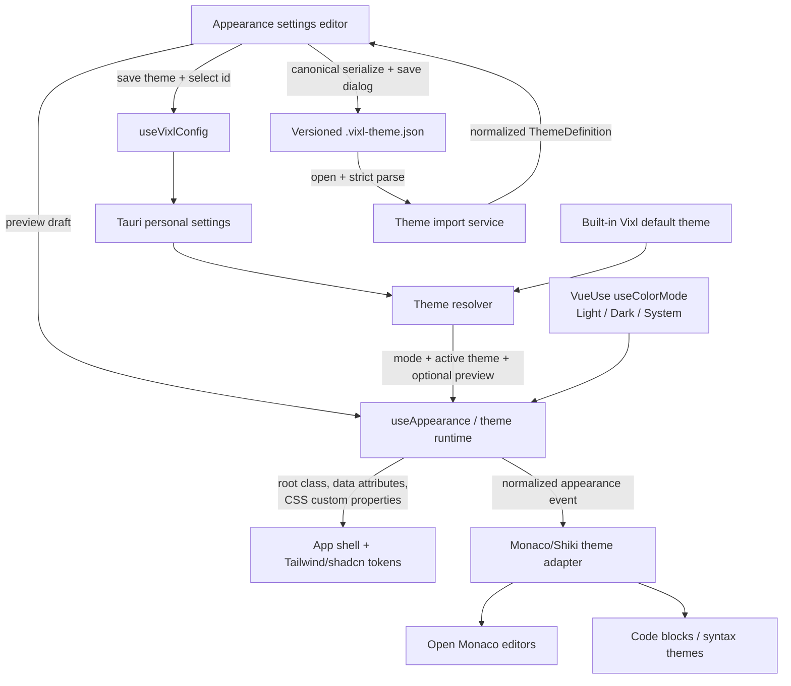

# Summary

Add a first-class Appearance system that preserves the existing Light/Dark/System mode while allowing users to create, preview, save, import, and export named themes. A theme customizes semantic UI colors, UI/monospace fonts, UI/editor font sizes, app canvas backgrounds (solid or structured gradient), and editor/code colors. Theme files are versioned JSON and intentionally exclude images, remote assets, arbitrary CSS, and a public marketplace.

# Context

- The Vue/Tauri app currently stores only `appearance.theme: 'light' | 'dark' | 'system'` in `VixlSettings` (`src/types/vixl/vixl-settings.ts`, `src/schemas/vixl-settings.ts`).
- `src/composables/use-appearance.ts` maps that setting to VueUse `useColorMode`; VueUse applies the root `dark` class and supports system mode through `auto`.
- Tailwind v4/shadcn semantic tokens are centralized as CSS variables in `src/assets/styles/css/tailwind.css`, but fonts and the 13px body size are currently fixed.
- Monaco and Shiki use hard-coded light/dark Vixl palettes in `src/utils/monaco-theme.ts`, `src/utils/monaco-shiki.ts`, and `src/components/ai-elements/code-block/vixl-code-theme.ts`. Monaco currently reacts only to root class mutations.
- Settings navigation is defined by `src/types/settings/settings-section.ts`, `src/components/settings/SettingsNav.vue`, and `src/components/settings/SettingsLayout.vue`; General currently hosts the basic mode toggle.
- Tauri already exposes JSON read/write commands and save dialogs (`src/services/vixl/vixl-tauri/config.ts`, `src/services/vixl/vixl-tauri/fs.ts`), but needs JSON-specific open/save wrappers for theme files.
- Scope decision: installed/custom themes and the active custom theme are personal platform preferences. Keep the existing color-mode key backward-compatible; strip theme-library keys from project overrides so project config cannot embed or replace a user's theme library.
- V1 sharing is file-based import/export only. No local/remote images, remote fonts, CSS snippets, links, gallery, or marketplace.

# Architecture

# Approach

## 1. Define a strict, versioned theme domain model

- Add dedicated theme types (for example under `src/types/appearance/`) rather than placing a large inline shape in `VixlSettings`.
- Model a `VixlThemeDefinition` with:
  - stable `id`, user-facing `name`, and theme format `version`;
  - `variants.light` and `variants.dark`, so the existing System mode remains meaningful;
  - complete semantic token maps corresponding to the currently used shadcn variables (background/surface/card/popover, foregrounds, primary/secondary/muted/accent/destructive, borders/ring, sidebar, charts);
  - a canvas background per variant with a required solid fallback and either `solid` or a structured gradient (`angle` plus 2–5 `{ color, position }` stops);
  - shared typography (`uiFontFamily`, `monoFontFamily`, `uiFontSize`, `editorFontSize`) with explicit fallback stacks;
  - editor/code palette values needed by Monaco and Shiki.
- Keep `appearance.theme` as the color mode for backward compatibility. Add personal settings for the active custom theme ID and custom theme library; use a reserved built-in ID for the unstored Vixl default.
- Extend `vixl-settings` validation/defaults and project-stripping behavior. Theme-library settings must be personal-only; malformed or missing active IDs resolve safely to the built-in theme.
- Create a separate strict import/export schema. Reject unknown fields, overlong names/families, unsupported versions, invalid IDs, colors outside the chosen safe hex forms, out-of-range font sizes/angles/stop positions, unsorted or excessive stops, excessive theme counts, and oversized files. Do not accept raw CSS, URLs, or font sources.
- Normalize imported IDs on collision while preserving the display name; serialize exports in a stable, canonical shape so export/import round trips are predictable.

## 2. Centralize theme resolution and runtime application

- Introduce a pure resolver that combines built-in defaults, the selected saved theme, the current light/dark result, and an optional in-memory preview draft into one effective appearance object.
- Expand `use-appearance.ts` (or split out a small shared appearance controller) to:
  - continue driving `useColorMode` from `appearance.theme`;
  - apply only allowlisted CSS variables to `document.documentElement`;
  - set stable appearance data attributes/revision markers;
  - expose begin/update/commit/cancel preview operations;
  - clear stale variables and preview state when returning to the built-in theme or when the editor unmounts;
  - emit one normalized appearance-change signal for non-CSS consumers.
- Avoid a second persistence source: configure VueUse so Vixl settings remain authoritative rather than allowing stale localStorage mode state to win during startup.
- Update `tailwind.css` to route font utilities and base font size through runtime variables while retaining current Inter/JetBrains Mono/13px fallbacks. Separate the app canvas/background-image variable from semantic panel surfaces.
- Apply the solid/gradient canvas at the top-level app backdrop and make only the intended shell layers transparent; keep cards, popovers, sidebars, inputs, and readable workbench surfaces on semantic surface tokens. Preserve title-bar hit regions and existing overflow behavior.
- Replace hard-coded decorative colors in `main.css` (mentions, skills, aurora/status accents) with semantic appearance variables where appropriate so custom themes feel coherent.

## 3. Adapt Monaco and Shiki to the effective appearance

- Refactor the fixed code palettes into reusable factories that accept the resolved light/dark editor palette and produce stable theme registrations.
- Give generated Monaco/Shiki themes collision-safe IDs derived from the active theme ID and variant, while retaining existing built-in IDs for the default theme.
- On the shared appearance-change signal, define/update the generated editor theme, call Monaco's global `setTheme`, and update every mounted editor's typography options (`fontFamily`, `fontSize`, and compatible line height). Extend the existing editor lifecycle/helper integration rather than creating per-component watchers.
- Ensure Shiki registers or refreshes the corresponding generated themes without reapplying the existing `shikiToMonaco` patch multiple times. Keep common language preloading and rare-language fallback behavior intact.
- Make code-block rendering and Monaco consume the same resolved editor palette to prevent theme drift, and retain readable hover/suggest widget foreground/background/border values.

## 4. Add a dedicated Appearance settings experience

- Add `appearance` to the personal settings section registry/navigation and render a new `AppearanceSection.vue`; leave update/version/shortcut controls in General, moving the Light/Dark/System control into Appearance to avoid duplicate controls.
- Provide:
  - Light/Dark/System selector;
  - theme selector with built-in Vixl Default plus saved/imported themes;
  - create-from-current/default, rename, duplicate, delete, and reset actions;
  - explicit edit target for Light or Dark variant while System mode previews the currently resolved variant;
  - semantic color controls (core controls first, advanced token/editor colors collapsible);
  - safe local font-family controls with bundled/system stack presets, UI font-size and editor font-size controls;
  - solid/gradient background editor with bounded stops and angle;
  - representative live preview (text, buttons, input, card/sidebar surfaces, gradient canvas, and code sample);
  - Apply/Save and Cancel semantics so experimental edits do not write settings on every input event.
- Guard destructive/reset actions with confirmation and provide toasts for validation, persistence, import, and export failures. Deleting the active theme must atomically fall back to the built-in theme.
- Ensure controls are keyboard accessible, color inputs have textual hex fields, focus indicators continue using semantic ring tokens, and preview text surfaces maintain usable contrast warnings without silently altering the user's chosen values.

## 5. Implement shareable JSON import/export through Tauri

- Add theme-specific file dialog helpers that open one `.vixl-theme.json` file and save with the same suggested extension, reusing the existing Tauri JSON read/write commands.
- Import flow: choose file, enforce a pre-parse size cap, read JSON, validate/normalize, show a summary preview, resolve ID/name collisions, then save to the personal theme library and optionally activate it.
- Export flow: require a saved/valid theme, strip runtime-only state, canonicalize the versioned payload, and write it via a save dialog with a sanitized default filename.
- Treat cancellation as a no-op rather than an error. Surface filesystem and schema failures without partially changing the active theme/library.
- Keep imported values data-only: no arbitrary style strings, URLs, HTML, scripts, image data, or remote font loading.

## 6. Preserve compatibility and document the format

- Existing users continue to get the exact current built-in palettes, fonts, sizes, and Light/Dark/System behavior when no custom theme is selected.
- Add migration/cleanup handling for invalid custom-theme state without bumping the general settings version unless the repository's migration conventions require it; the theme file has its own independent version.
- Document user workflows and the supported theme JSON format, constraints, and non-goals in the project docs so files can be shared independently of a marketplace.

# Test plan

- **Theme schema/unit tests**
  - Accept a complete valid two-variant theme and canonical export/import round trip.
  - Reject unknown versions/keys, malformed colors, unsafe font/URL/CSS values, duplicate IDs, invalid gradients, out-of-range sizes, excessive stops/count/payload, and incomplete token maps.
  - Verify collision-safe ID normalization and filename sanitization.
- **Settings/config tests**
  - Validate new defaults and legacy settings with only `appearance.theme`.
  - Verify personal theme library persistence, active-theme fallback, project stripping, merge behavior, deletion of the active theme, and atomic import failure.
- **Resolver/runtime DOM tests (jsdom)**
  - Resolve built-in, saved, missing, and preview themes for forced Light/Dark and System changes.
  - Assert root classes/data attributes/CSS variables, gradient generation from structured stops, cleanup on cancel/reset, and no stale VueUse storage overriding settings.
- **Monaco/Shiki tests with mocked APIs**
  - Verify generated theme IDs/data, light/dark switching, readable widget colors, one-time Shiki wiring, open-editor typography updates, and repeated preview changes without duplicate patching/listeners.
- **Vue component tests**
  - Exercise create/edit/duplicate/delete/reset, variant selection, bounded gradient/font controls, preview Apply/Cancel, contrast warnings, import summary, export cancellation, and accessible labels/keyboard focus.
- **Tauri service tests**
  - Mock open/save/read/write calls for success, cancellation, invalid JSON, size rejection, filesystem failure, and canonical exported output.
- **Regression/manual verification**
  - Run `npm run type-check`, targeted Vitest suites, then the full `npm run test:run` and lint/build checks.
  - Manually test cold start and live switching in Light/Dark/System on macOS plus another supported platform; inspect settings, sidebars, dialogs/popovers, chat markdown/code blocks, Monaco hover/suggest widgets, charts, title bar, and gradient visibility.
  - Export a theme, remove it, re-import it, and confirm visual/editor parity and persistence across restart with no flash of the wrong mode.