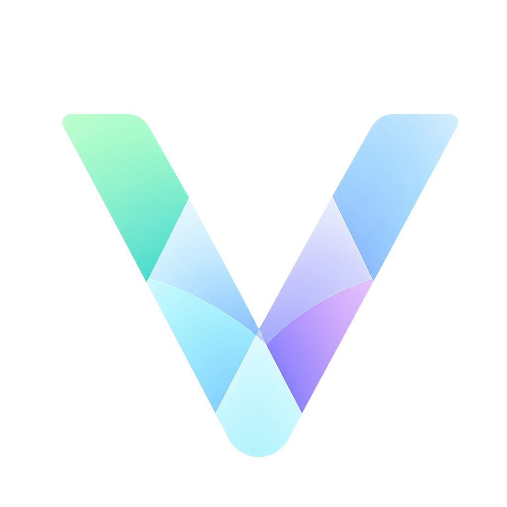

  

<h1 align="center">vixl</h1>

  
  
  
  
  
  

  
  
  
  
  
  
  
  
  

---

## Sponsored by

<table align="center">
  <tr>
    <td align="center" valign="middle">
      <a href="https://getminds.ai/" target="_blank" rel="noreferrer">
        <picture>
          <source media="(prefers-color-scheme: dark)" srcset="./docs/media/readme/minds-dark.png" />
          
        </picture>
      </a>
       
      <a href="https://getminds.ai/">Minds</a>
    </td>
    <td align="center" valign="middle">
      <a href="https://www.getniche.ai/" target="_blank" rel="noreferrer">
        <picture>
          <source media="(prefers-color-scheme: dark)" srcset="https://www.getniche.ai/niche-logo-dark.png" />
          
        </picture>
      </a>
       
      <a href="https://www.getniche.ai/">Niche</a>
    </td>
  </tr>
</table>

---

Vixl is an open alternative to Antigravity, Cursor, and VS Code agents.

Save on token costs by utilizing routers, sales, and model mixing.

Local first design, built originally for using Qwen on a Halo Strix.

[View the estimated token counts](./spec/src/services/context/system-prompt-token-snapshot.test.ts)

## Getting started

<strong>Install</strong>

Install a prebuilt app:

1. Download the installer for your platform (macOS arm64, Linux x64, Windows) from [GitHub Releases](https://github.com/vixl-ai/vixl/releases).
2. Verify the download with `SHA256SUMS.txt` from the same release tag: run `shasum -a 256 -c SHA256SUMS.txt` on macOS or `sha256sum -c SHA256SUMS.txt` on Linux.
3. Open the installed app.

Or build from source:

1. Install Node.js matching [`.nvmrc`](./.nvmrc) and a Rust toolchain from [rustup.rs](https://rustup.rs/).
2. Clone the repo and install dependencies: `git clone https://github.com/vixl-ai/vixl.git && cd vixl && npm ci`.
3. Start the desktop shell with `npm run tauri -- dev`.

<strong>Add a provider key</strong>

1. Open **Settings** from the sidebar footer.
2. Go to **Providers**.
3. Click **Add provider** and pick a catalog provider or a custom OpenAI-compatible endpoint.
4. Paste your API key into the key field and save. Ollama needs no key and defaults to `http://localhost:11434/v1`.
5. Click **Test connection** to confirm the key works.

Keys are stored in the OS keychain. They are never written to `.vixl` or `settings.json`.

<strong>Select a default model</strong>

1. Open **Settings > Models**.
2. Set **Default** to the model every role falls back to.
3. Override individual roles if you want different models for **Ask**, **Plan**, **Agent**, **Orchestrator** (Parent, plus nested **Subagent**), or **Title**.
4. Toggle **Auto-title** on the Title role to generate short chat titles.

Without a Default model, starting a chat from the sidebar or file tree shows: `Select a default model in Settings before starting a chat`.

<strong>Add a project</strong>

1. Click **Add project** in the Chats toolbar of the sidebar.
2. Choose the folder to register as a project.

You can also pick a project from the project picker on the home screen. **No project** starts a home chat that is not tied to a repo.

<strong>Start a chat</strong>

1. Click **New Agent** in the sidebar to open home.
2. Pick a project in the project picker, or keep **No project**.
3. Pick a mode: **Agent**, **Ask**, **Orchestrator**, or **Plan**.
4. Pick a model with **Select model** and set the permission dial (**Ask**, **Allowlist**, **Bypass**).
5. Type your prompt and send it. Use `@` to mention workspace files and `/` to run skills and agents.

<strong>How vixl compares</strong>

Sources: [GitHub Copilot plans](https://docs.github.com/en/copilot/get-started/plans), [VS Code language models](https://code.visualstudio.com/docs/copilot/language-models), [VS Code BYOK](https://code.visualstudio.com/blogs/2026/06/18/byok-vscode), [VS Code license](https://code.visualstudio.com/license), [VS Code MCP](https://code.visualstudio.com/docs/agent-customization/mcp-servers), [Cursor pricing](https://cursor.com/pricing), [Cursor models](https://cursor.com/docs/models-and-pricing), [Cursor API keys](https://cursor.com/docs/settings/api-keys), [Cursor MCP](https://cursor.com/docs/mcp), [Cursor terms](https://cursor.com/terms-of-service), [Antigravity pricing](https://antigravity.google/pricing), [Antigravity models](https://antigravity.google/docs/models/), [Antigravity plans](https://www.antigravity.google/docs/plans/), [Antigravity MCP](https://antigravity.google/docs/mcp/).

| | vixl | VS Code + GitHub Copilot | Cursor | Google Antigravity |
| --- | --- | --- | --- | --- |
| Editor cost | Free (MIT app) | Editor is free to download. The vscode source is MIT. The shipped VS Code binary uses a Microsoft product license. | Hobby is free. Pro $20/month, Pro+ $60/month, Ultra $200/month. Teams $40 and $120 per user/month. | Individual free tier with weekly rate limits. Higher quotas via Google AI Pro $19.99/month and Google AI Ultra. |
| AI cost | You pay the host you configured (BYOK). No vixl subscription. | Copilot Free $0 (limited credits, 2,000 completions/month), Pro $10/month, Pro+ $39/month, Max $100/month, Business $19/seat, Enterprise $39/seat. Extra usage billed as AI credits at $0.01 each. Copilot is a commercial subscription. | On-demand overage at API rates. Teams/Enterprise add a Cursor Token Rate of $0.25 per million tokens on third-party models, including BYOK. | Rate limits on the free tier. Paid Google AI plans raise quotas. Official docs: no BYOK or bring-your-own-endpoint for extra rate limits. |
| License | MIT | vscode source MIT; shipped binary Microsoft product license; Copilot commercial. | Proprietary. | Proprietary. |
| Model choice / BYOK | BYOK for the first-party provider catalog, custom OpenAI-compatible endpoints, and Ollama. Keys stay in the OS keychain. | Paid Copilot plans: picker over GitHub-hosted models (OpenAI, Anthropic, Google, xAI, others). Free plan is auto-model only. BYOK in VS Code Chat (Azure, Anthropic, Gemini, OpenAI, OpenRouter, Hugging Face, custom endpoints) does not apply to code completions. BYOK keys use VS Code SecretStorage (OS keychain backed). | Cursor-hosted Grok and Composer models plus third-party Anthropic, Google, OpenAI, and others listed in Cursor's model docs. BYOK: OpenAI, Anthropic, Google, Azure OpenAI, AWS Bedrock. Chat only. Tab completion always uses Cursor models. Keys are sent to Cursor's backend with every request for prompt building. Zero Data Retention does not apply to BYOK. | Gemini 3.8/3.7/3.6 Flash, Gemini 3.1 Pro, plus Claude Sonnet/Opus 4.6 (thinking) and GPT-OSS-120b on consumer plans. No first-party BYOK for extra limits (see AI cost). |
| Local and offline | Offline with local models (Ollama and other local OpenAI-compatible hosts). No account required. | Local models (Ollama, Foundry Local, custom endpoints) work for chat, but take extra configuration and still require a GitHub account. Completions still need Copilot. | Not a first-party local provider (no official Ollama support). AI features require Cursor's backend. | No first-party local inference for the reasoning model. No documented offline mode. |
| MCP | stdio, http, and sse. | Yes: stdio and HTTP, workspace or user `mcp.json`. | Yes: stdio, SSE, Streamable HTTP. | Yes: stdio, Streamable HTTP, SSE. |

<strong>What vixl does not include</strong>

vixl ships no bundled product integrations. It does not pick a browser, a ticket tracker, or a cloud for you.

For example: there is no built-in browser automation or CDP. If you want a browser in the agent loop, add an MCP server you already use (Chrome MCP, Safari MCP, Playwright MCP, or another). People run different browsers, so vixl does not pick one.

If an MCP server exists for a tool, add it to `mcp.json` and vixl can use it.

<strong>Left sidebar</strong>

The sidebar lists your chats grouped by project, each with a status label like **Running**, **Needs approval**, or **Done**. From here you can start a new chat, search across projects and chats, pin chats, filter by status, add a project, and open **Settings**.

Right-click a chat to rename, fork, pin, or delete it.

<strong>Home</strong>

Home is the screen vixl opens on. Type a prompt in the text box at the bottom and send it to start a chat.

Before you send, the bar under the input lets you set up the chat:

- **Project**: **No project** (not tied to a repo) or one of your added projects.
- **Mode**: **Agent**, **Ask**, **Orchestrator**, or **Plan**. See [Chat view](#chat-view).
- **Model**: overrides your default model for this chat only.
- **Permissions**: how often the agent asks before it acts.
- **Attachments**: add images to the prompt.
- **MCP** and **Skills**: choose which servers and skills the chat can use.

<strong>Chat view</strong>

There are four modes. **Ask** answers questions without changing files. **Plan** researches and writes a plan document. **Agent** makes the changes. **Orchestrator** splits work across sub-agents.

The permission dial controls how much the agent can do on its own: **Ask** (approve each action), **Allowlist** (actions you have allowed before run freely, anything new asks), or **Bypass** (file changes run without asking; shell, web, and MCP still ask).

When the agent needs approval, you can allow an action once, for the session, for the workspace, or always, or deny it.

Long conversations can be compacted to save context. You can queue messages while the agent works, watch and stop sub-agents, and export a transcript.

<strong>Workbench</strong>

The right sidebar is the workbench. It has an editor (the same Monaco core as VS Code, with a file tree and language server support), terminals that open in your project, and a git view for status and diffs. Plans and running agent shells open here as tabs too.

<strong>Project view</strong>

Each project gets a page with tabs for its chats, MCP servers, code graph, plans, skills, agents, and rules. These mirror the personal versions in Settings but apply only to that project.

The **Graph** tab shows the code index for the project. Search a symbol or file to see its callers, callees, and impact, or rebuild the index.

<strong>Settings</strong>

Settings holds everything that applies to you rather than one project: theme and updates, providers and models, language servers, permissions, and your personal MCP servers, plans, skills, agents, and rules.

Permissions is where you review what agents have been allowed to do: sandboxed terminal and network rules, stored allow and deny records, and a **Clear all** reset.

<strong>The .vixl directory</strong>

vixl keeps two config trees. API keys are in the OS keychain, not in either one.

Personal config lives in your app data folder under `.vixl`:

| Path | What it holds |
| --- | --- |
| `settings.json` | App settings: theme, models, permissions |
| `mcp.json` | Personal MCP servers |
| `vixl.sqlite` | Chat history and usage |
| `graphs/` | Code graph indexes |
| `agents/`, `skills/`, `plans/`, `rules/`, `AGENTS.md` | Your personal agents, skills, plans, rules, and instructions |

Project config lives at `<repo>/.vixl` and can be committed to share with a team:

| Path | What it holds |
| --- | --- |
| `settings.json` | Project overrides (never providers or models) |
| `mcp.json` | Project MCP servers (override personal ones by name) |
| `agents/`, `skills/`, `plans/`, `rules/`, `AGENTS.md` | The same files, scoped to the project |

<strong>Codegraphs</strong>

vixl indexes each project into a code graph so agents can search symbols and see how the code connects instead of reading files one by one. Indexes are stored per user, never in the repo.

The project's **Graph** tab shows index status and stats, and lets you search a symbol or file to explore its callers, callees, and impact. Use **Rebuild index** to refresh it.

<strong>MCP</strong>

Add MCP servers in Settings (personal) or on the project page (project). Config lives in `mcp.json`, and project servers override personal ones with the same name.

Servers can run over stdio, http, or sse. Stdio servers launch through common runners like `npx`, `uvx`, or `docker`. Secrets such as tokens are stored in the keychain, and vixl asks before trusting a new server. HTTP servers can sign in with OAuth.

Once connected, agents can call the server's tools in any chat.

<strong>Agents and chat modes</strong>

The four chat modes (**Agent**, **Ask**, **Orchestrator**, **Plan**) are built in. See [Chat view](#chat-view).

Custom agents are your own: markdown files in `.vixl/agents/` with a name, description, and optional model and tools. Create one with **New agent**, then run it with `/` in a chat. Custom agents run as sub-agents, so a chat can hand work to them.

<strong>Plans</strong>

Plan mode writes a plan document with a todo list, saved under `.vixl/plans/`. You can also create one by hand with **New plan**.

When the plan looks right, **Build now** has an agent implement the todos, or **Orchestrate** fans them out to background sub-agents that work in parallel.

<strong>Skills, Rules, and AGENTS.md</strong>

Skills are reusable instruction packs in `.vixl/skills/`, run with `/` or loaded by agents when relevant. Rules in `.vixl/rules/` and a top-level `AGENTS.md` are always-on instructions added to every chat.

Each exists at personal and project level. When both define the same thing, the project version wins.

## Roadmap

1. Image edit and create support
2. Theme, glass, and deeper personalization

## Contributing

- Read [CONTRIBUTING.md](./CONTRIBUTING.md) for setup, PR process, and signed commits.
- Follow [CODE_OF_CONDUCT.md](./CODE_OF_CONDUCT.md).
- Report vulnerabilities via [SECURITY.md](./SECURITY.md).
- Before a PR, run `npm run ci` (lint, type-check, coverage, npm audit, build). Touching `src-tauri` also needs `npm run audit:rust`.
