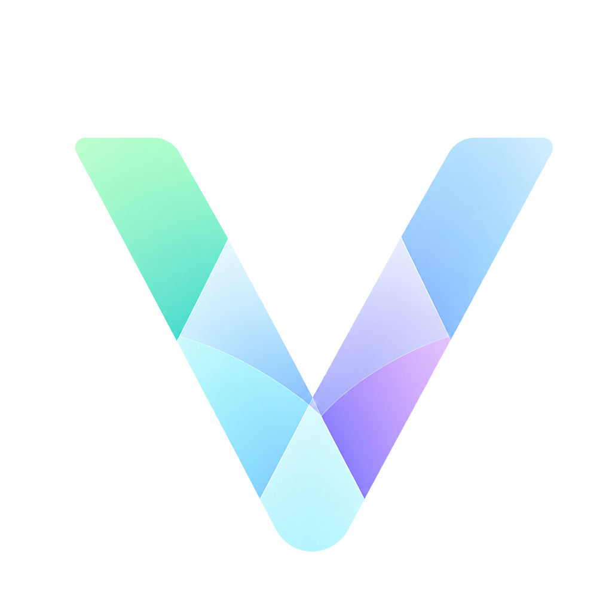

  

<h1 align="center">Vixl</h1>

  

  
  

  
  
  
  
  
  
  
  
  

---

## Sponsored by

<table align="center">
  <tr>
    <td align="center" valign="middle">
      <a href="https://getminds.ai/" target="_blank" rel="noreferrer">
        <picture>
          <source media="(prefers-color-scheme: dark)" srcset="./docs/media/readme/minds-dark.png" />
          
        </picture>
      </a>
       
      <a href="https://getminds.ai/">Minds</a>
    </td>
    <td align="center" valign="middle">
      <a href="https://www.getniche.ai/" target="_blank" rel="noreferrer">
        <picture>
          <source media="(prefers-color-scheme: dark)" srcset="https://www.getniche.ai/niche-logo-dark.png" />
          
        </picture>
      </a>
       
      <a href="https://www.getniche.ai/">Niche</a>
    </td>
  </tr>
</table>

---

  

---

**Vixl is a local-first, bring-your-own-key alternative to Cursor, Antigravity, and VS Code agents.** There is no Vixl account and no Vixl subscription.

Use any catalog provider or a local host. Four [chat modes](https://vixl.app/concepts/chat-modes), durable [plans](https://vixl.app/using/work-with-plans), [MCP](https://vixl.app/customize/mcp-servers), and a workbench. In a [worked example](https://vixl.app/using/best-practices), planning once and running implementation on a cheaper sub-agent costs about 70% less than one long full-price chat.

[Get started](https://vixl.app/getting-started/) or download the [latest release](https://github.com/vixl-ai/vixl/releases).

## Roadmap

View the [roadmap](https://vixl.app/resources/roadmap)

## Contributing

- Read [CONTRIBUTING.md](./CONTRIBUTING.md) for setup, PR process, and signed commits.
- Follow [CODE_OF_CONDUCT.md](./CODE_OF_CONDUCT.md).
- Report vulnerabilities via [SECURITY.md](./SECURITY.md).
